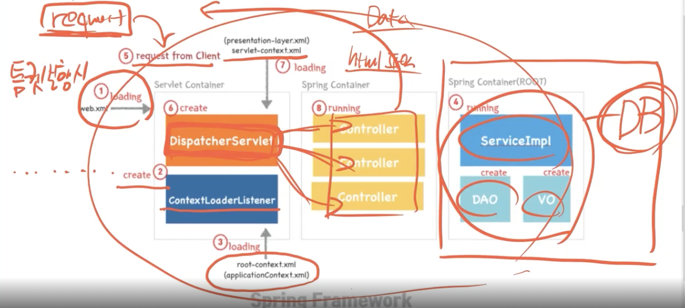

-   Chapter14

## 3. Spring Boot 동작 원리(7)

8. 요청 주소에 따른 적절한 컨트롤로 요청(Handler Mapping)
9. Response 처리

---

### Handler Mapping

-   URI요청이 오면 적절한 Controller의 함수를 찾아 실행함

### Response

-   File 또는 Data
    -   File
        -   ViewResolver 관여(HTML)
    -   Data
        -   MessageConverter 작동(json)

```java
// File
class hello{

    @GetMapping("/web-INF/views/")
    public String Hello(){
        return "Hello";
    }
}
// Response: /web-INF/views/hello
...

// Data
class hello{

    @GetMapping("/web-INF/views/")
    public User Hello(){
        User S = new User();
        S.setID(1);
        S.setname("Sungwon");
        return S;
    }
}
// Response: "id" : 1, "name" : "Sungwon"
```

-   Summary
    
